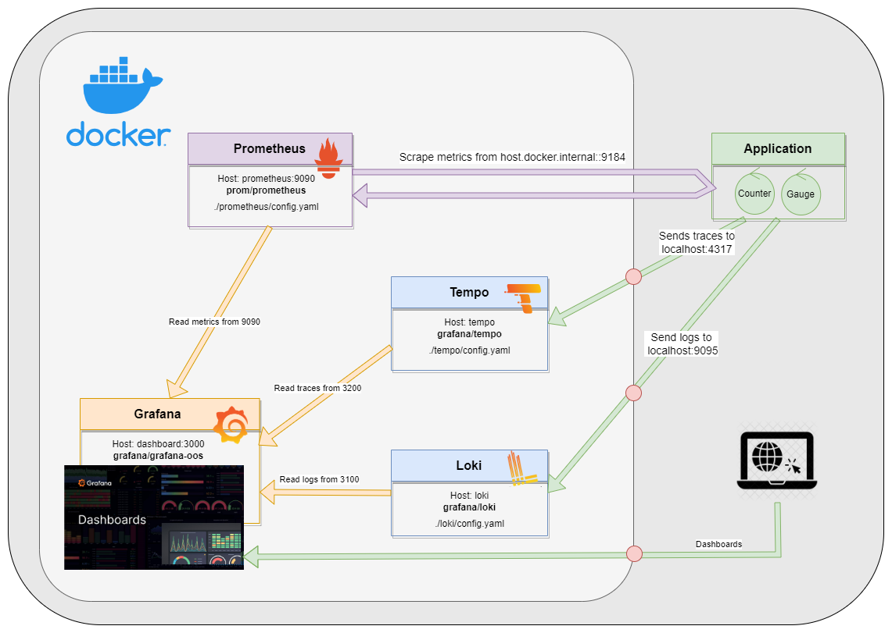
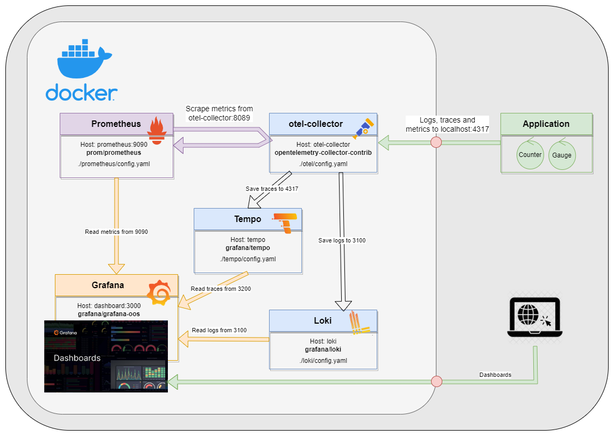

# OpenTelemetryUsing
Sample application showing how to write up ASP.NET Core REST API application with OpenTelemetry and export: 
 - metrics to the [Prometheus](https://prometheus.io/);
 - logs to the [Grafana Loki](https://grafana.com/oss/loki/);
 - traces to the [Grafana Tempo](https://grafana.com/oss/tempo/).
 - all telemetry to the [Azure Application Insights](https://learn.microsoft.com/en-us/azure/azure-monitor/app/app-insights-overview)

Three architectural solutions are used:

## Solution #1
 - The Prometheus scrapes metrics from the application. 
 - The application pushes logs to Loki. 
 - The application pushes traces to Tempo.

## Solution #2
 - The application pushes logs, traces, and metrics to the [OpenTelemetry Collector](https://opentelemetry.io/docs/collector/). 
 - The Prometheus scrapes metrics from the Collector. The collector pushes logs to the Loki and traces to the Tempo.

## Solution #3
 - The application pushes logs, traces, and metrics to the [Azure Application Insights](https://learn.microsoft.com/en-us/azure/azure-monitor/app/app-insights-overview).

The solution was based on [an article](https://learn.microsoft.com/en-us/dotnet/core/diagnostics/observability-with-otel).
